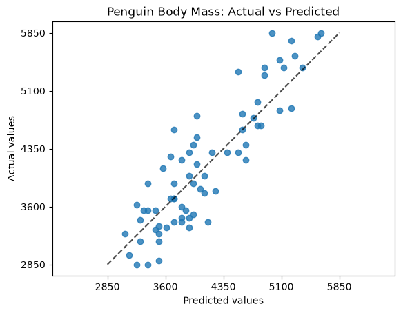
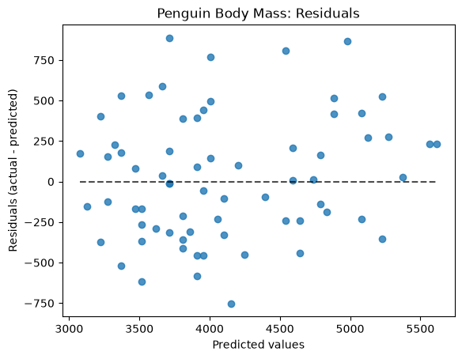
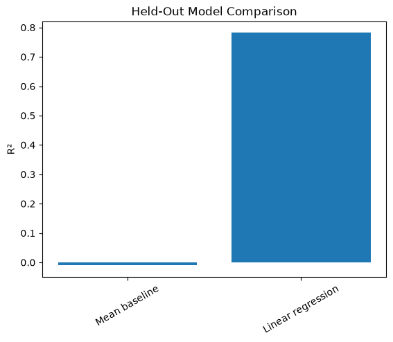

# penguins-body-mass: Penguin Body-Mass Regression

[](https://applied-models.github.io/penguins-body-mass/)
[](https://github.com/applied-models/penguins-body-mass)
[](./pyproject.toml)
[](./LICENSE)

[](https://github.com/applied-models/penguins-body-mass/actions/workflows/ci-python-zensical.yml)
[](https://github.com/applied-models/penguins-body-mass/actions/workflows/deploy-zensical.yml)
[](https://github.com/applied-models/penguins-body-mass/actions/workflows/links.yml)
[](https://github.com/applied-models/penguins-body-mass/security)

> A supervised machine-learning experiment predicting penguin body mass
> from flipper length.

## Purpose

This project asks a simple analytical question:

> How well can **flipper length** predict **penguin body mass**?

The experiment uses the **Palmer Penguins dataset** and compares:

- a mean-value baseline using `DummyRegressor`
- a candidate `LinearRegression` model

The project separates the analyst's experimental decisions from their
execution.

`plan_experiment.py` declares the experiment specification.

`run_experiment.py` loads the data, validates the specification against the
observed data, executes the experiment, evaluates the models, and generates
the visual evidence.

## Experiment Design

The experiment is:

- **Grain:** one penguin
- **Learning mode:** supervised
- **Problem type:** regression
- **Target:** `body_mass_g`
- **Selected feature:** `flipper_length_mm`
- **Missing-value resolution:** drop observations missing required values
- **Train/test split:** reproducible random 80/20 holdout
- **Baseline:** mean-value `DummyRegressor`
- **Candidate:** `LinearRegression`

Both models are trained and evaluated using the same experimental basis so
their held-out performance can be compared directly.

## Experiment Results

The experiment used 342 complete observations,
with 273 observations for training
and 69 held out for testing.

| Model             |     R² |      MAE |     RMSE |
| ----------------- | -----: | -------: | -------: |
| Mean baseline     | -0.010 | 693.15 g | 819.59 g |
| Linear regression |  0.782 | 315.86 g | 380.69 g |

The linear regression model substantially outperformed
the mean-value baseline on the held-out test observations.

The generated charts provide three complementary views
of the experimental evidence.

### Actual vs. Predicted Body Mass

A standard regression diagnostic compares the actual target values with the
values predicted by the candidate model.

Predictions closer to the reference line indicate smaller prediction errors.



### Candidate Model: Residuals

Residuals show the prediction errors for the candidate model.

Examining their distribution and pattern helps identify systematic error,
unusual observations, and areas where the model does not explain the data
well.



### Baseline vs. Candidate Model

A useful candidate model should outperform a simple baseline using the same
held-out observations.

This comparison shows the held-out R² for the mean-value baseline and the
linear regression model.



Together, the held-out metrics and regression diagnostics support the
conclusion that flipper length provides substantial predictive information
about penguin body mass while still leaving meaningful unexplained variation.

Generated charts are saved to:

```text
docs/images/
├── actual-vs-predicted.png
├── residuals.png
└── model-comparison.png
```

## Run the Experiment

Run the complete experiment from the repository root:

```shell
uv run python -m penguins_body_mass.app
```

The experiment:

1. Loads the Palmer Penguins dataset.
2. Validates the declared experiment against the observed data.
3. Resolves missing required values.
4. Creates the declared train/test split.
5. Trains the baseline model.
6. Trains the candidate model.
7. Evaluates both models on the same held-out observations.
8. Generates and saves the evaluation charts.
9. Records the experiment assessment.

## Developer Command Reference

<details>
<summary>Show command reference</summary>

### In a machine terminal

Open a machine terminal where you want the project:

```shell
git clone https://github.com/applied-models/penguins-body-mass

cd penguins-body-mass
code .
```

### In a VS Code terminal

```shell
uv self update
uv python pin 3.14
uv python install
uv lock --upgrade
uv sync

uv run pre-commit install
uv run pre-commit autoupdate

git add -A
uv run pre-commit run --all-files
# repeat if changes were made
uv run pre-commit run --all-files

# run locally to test
uv run python -m penguins_body_mass.app

# types, tests, docs
uv run ty check
uv run python -m pytest
uv run python -m zensical build

# save progress
git add -A
git commit -m "update"
git push -u origin main
```

</details>

## Documentation

- [Documentation](https://applied-models.github.io/penguins-body-mass/)

## Data Card

- [Palmer Penguins Data Card](./docs/data-card.md)

## Annotations

- [.annotations/annotations.md](./.annotations/annotations.md)

## Citation

- [CITATION.cff](./CITATION.cff)

## License

This project is licensed under the [MIT License](./LICENSE).
